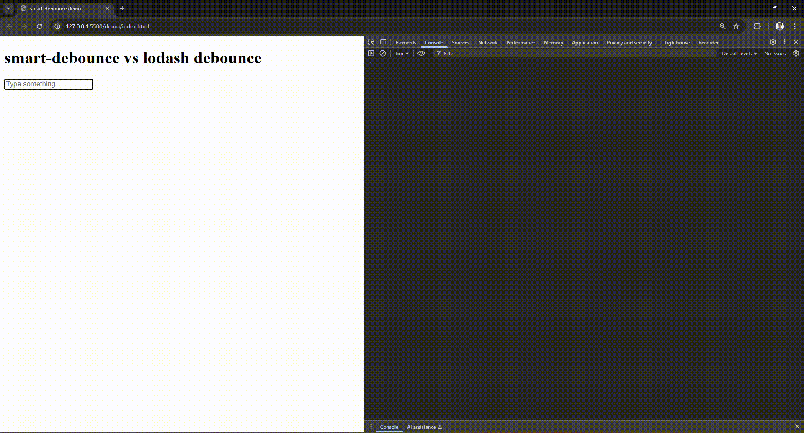

# debounce-zen (smartDebounce)

*An adaptive debounce & throttle utility — smarter than `lodash.debounce`.*

---

## Why `debounce-zen`?

Traditional debouncing (like `lodash.debounce`) always waits a **fixed delay** before executing.
That’s okay, but not ideal:

-  Too **slow** when the user pauses briefly — bad UX.
-  Too **eager** when typing quickly — spams your backend.

### `debounce-zen` adapts to the user's input speed:

-  Fires **faster** if the user slows down.
-  Fires **later** if the user is typing quickly.
-  Plus: `cancel()`, `flush()`, `priority()`, **async support**, and **lifecycle hooks**.

---

## 📦 Install

```bash
npm install debounce-zen
```
## 🛠 Usage
Node.js / ESM
```
import { smartDebounce } from "debounce-zen";

// Adaptive debounce (default)
const saveHandler = smartDebounce((value) => {
  console.log("Saved:", value);
}, { mode: "adaptive", min: 200, max: 1500 });

saveHandler("hello");
```
Browser (demo / CDN)
```
<script type="module">
  import { smartDebounce } from "https://cdn.jsdelivr.net/npm/debounce-zen/+esm";

  const log = smartDebounce(console.log);
  log("typing...");
</script>
```
## ⚡ Comparison

| Feature                         | `lodash.debounce` | `debounce-zen` |
|---------------------------------|-------------------|------------------|
| Fixed debounce delay            | ✅                | ✅               |
| Throttle mode                   | ✅                | ✅               |
| Adaptive delay                  | ❌                | ✅               |
| Leading / trailing calls        | ✅                | ✅               |
| Cancel pending call             | ✅                | ✅               |
| Flush immediately               | ❌                | ✅               |
| Priority (run now, skip wait)   | ❌                | ✅               |
| Async function support          | ❌                | ✅               |
| Lifecycle hooks (`onExecute`…)  | ❌                | ✅               |

## 🔑 API
```
smartDebounce(fn, options) => wrappedFn
```
## ⚙️ Options

| Option     | Type                                      | Default    | Description                    |
|------------|-------------------------------------------|------------|--------------------------------|
| `mode`     | `"adaptive"` \| `"debounce"` \| `"throttle"` | `"adaptive"` | Execution strategy             |
| `min`      | `number`                                  | `200`      | Minimum delay (adaptive mode)  |
| `max`      | `number`                                  | `1500`     | Maximum delay (adaptive mode)  |
| `delay`    | `number`                                  | `300`      | Fixed delay (debounce mode)    |
| `interval` | `number`                                  | `300`      | Fixed interval (throttle mode) |
| `leading`  | `boolean`                                 | `false`    | Fire on leading edge           |
| `trailing` | `boolean`                                 | `true`     | Fire on trailing edge          |
| `onExecute`| `Function`                                | –          | Called when function executes  |
| `onCancel` | `Function`                                | –          | Called when call is canceled   |
| `onFlush`  | `Function`                                | –          | Called when call is flushed    |

## 🔁 Wrapped Function Methods

After wrapping a function with `debounce-zen`, the returned function includes these utility methods:

| Method              | Description                         |
|---------------------|-------------------------------------|
| `wrapped.cancel()`  | Cancel pending execution            |
| `wrapped.flush()`   | Execute immediately if pending      |
| `wrapped.priority()`| Run immediately, skip debounce wait |


## 🎮 Demo

Type into the input — see the difference between `lodash.debounce` and `debounce-zen`:

👉 [Try it live on CodeSandbox](https://codesandbox.io/p/sandbox/fxlwxl)




## MIT License
```
Copyright (c) 2025 Siddarthan

Permission is hereby granted, free of charge, to any person obtaining a copy
of this software and associated documentation files (the "Software"), to deal
in the Software without restriction, including without limitation the rights
to use, copy, modify, merge, publish, distribute, sublicense, and/or sell
copies of the Software, and to permit persons to whom the Software is
furnished to do so, subject to the following conditions:

The above copyright notice and this permission notice shall be included in all
copies or substantial portions of the Software.

THE SOFTWARE IS PROVIDED "AS IS", WITHOUT WARRANTY OF ANY KIND, EXPRESS OR
IMPLIED, INCLUDING BUT NOT LIMITED TO THE WARRANTIES OF MERCHANTABILITY,
FITNESS FOR A PARTICULAR PURPOSE AND NONINFRINGEMENT. IN NO EVENT SHALL THE
AUTHORS OR COPYRIGHT HOLDERS BE LIABLE FOR ANY CLAIM, DAMAGES OR OTHER
LIABILITY, WHETHER IN AN ACTION OF CONTRACT, TORT OR OTHERWISE, ARISING FROM,
OUT OF OR IN CONNECTION WITH THE SOFTWARE OR THE USE OR OTHER DEALINGS IN THE
SOFTWARE.
```